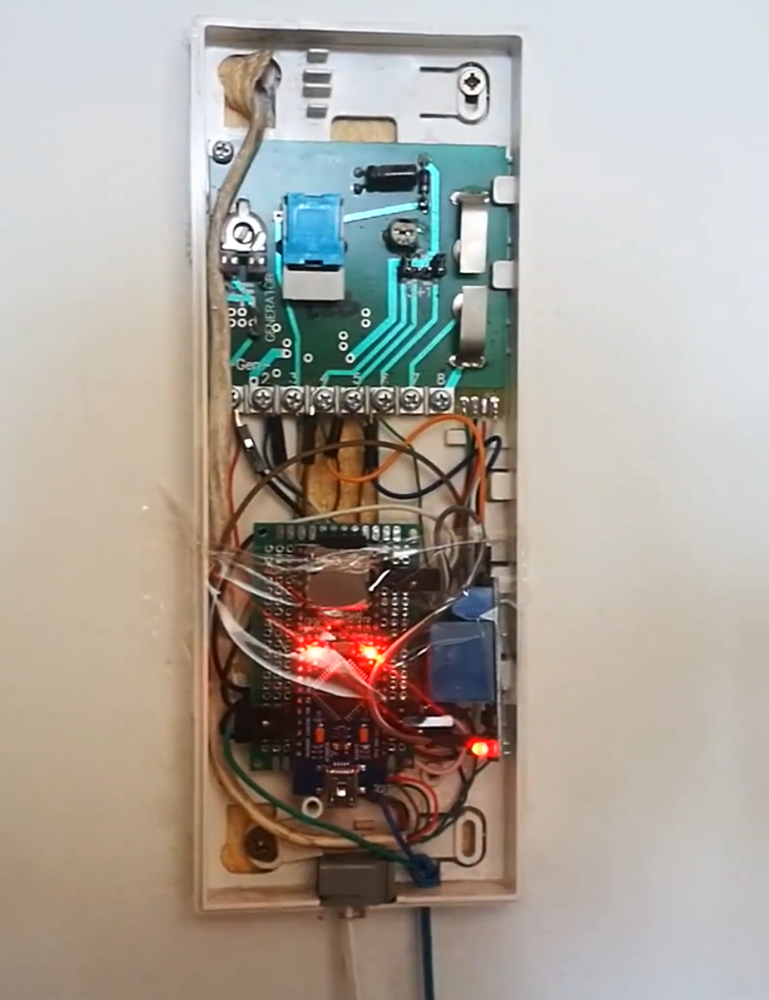

import Youtube from "@/components/Youtube"

W 2018 waletowałem u kolegi. Dorobiłem klucze do mieszkania, ale nie dało się dorobić klucza do klatki schodowej ponieważ oryginał był zgięty. Ślusarz powiedział że nie da się takiego klucza skopiować. Oryginał normalnie otwierał drzwi do klatki. Pytałem czy da się taki klucz wyprostować ale powiedział że prawie napewno się od tego złamie. Nie za bardzo dało się poprosić landlorda o dodatkowy klucz dla mnie, bo w końcu nie wiedział że tam mieszkam.

## Domofon dobrze działał

Domofon był normalny jak w starej kamienicy niedaleko Olsztyńskiej starówki. Każde mieszkanie miało swój przycisk, bez żadnych kodów itp. Funkcjonalności domofonu
1. dzwonienie do wybranego mieszkania
2. odbieranie połączenia
3. rozmowa
4. otwieranie drzwi
Miałem zamiar podłączyć arduino do punktów 1. oraz 4. Jak się później okazało całkiem zabawne było później połączenie się z punktem 3.

## Arduino

Kupiłem od chińczyka kilka sztuk po dwa dolary. Wykorzystałem multimetr i dokumentację domofonu znalezioną w internecie aby rozkminić do których pinów połączyć ADC z Arduino. Następnie Implementacja była już dość prosta. upierdliwe było jedynie wgrywanie kodu na arduino jak to zwykle przy takich projektach, gdzie nie można zbyt szybko iterować. Chyba że ma się piekielnie długie kable lub jakieś sprytne wgrywanie kodu przez wifi itp. ja nie miałem
<Youtube videoId="6tuDXU8ow9M" />

## Algorytm
Należało zadzwonic 4 razy (w określonych odstępach czasowych) do mojego mieszkania aby puścić napięcie na obwód z przekaźnikiem który był w miejscu gdzie normalnie otwiera się furtkę. Musiałem dać szerokie widełki czasowe aby dało się z tego korzystać i pewien czas po którym się to resetowało.
<Youtube videoId="KKOZTo64eQk" />

## Wifi
W 2018 każdy już miał smartfona więc można się zastanawiać czemu tego nie użyłem w moim projekcie aby po prostu zdalnie otwierać furtkę jak już byłem podłączony do linii domofonu? Któtko mówiąc było to bardzo niestabilne - nie chciałem na tym polegać - przypomnę że była to moja jedyna opcja wejścia na klatkę jak nie było kumpla w domu. I zdarzyło się parę razy że miałem to już skonfigurowane na wifi na ESP32, i nie wiadomo czemu coś się zawiesiło i przestało działać

## Dźwięki
<Youtube videoId="lfNpqSJsEVw" />
Jak już miałem działającą rzecz, dalej się zastanawiałm co można ulepszyć. I okazało się że dość łatwo można podłaczyć się do linii gdzie jest przekazywany dźwięk rozmowy domofonu - sygnał analogowy. Podłączyłem odtwarzacz mp3 od chińczyka który był malutką płytką drukowaną wielkości karty micro-sd. Była tam oczywiście również karta na którą wgrałem śmieszne dźwięki które były odtwarzane po tym jak wprowadziło się prawidłowy kod - cztery dzwonki w równych odstępach.
