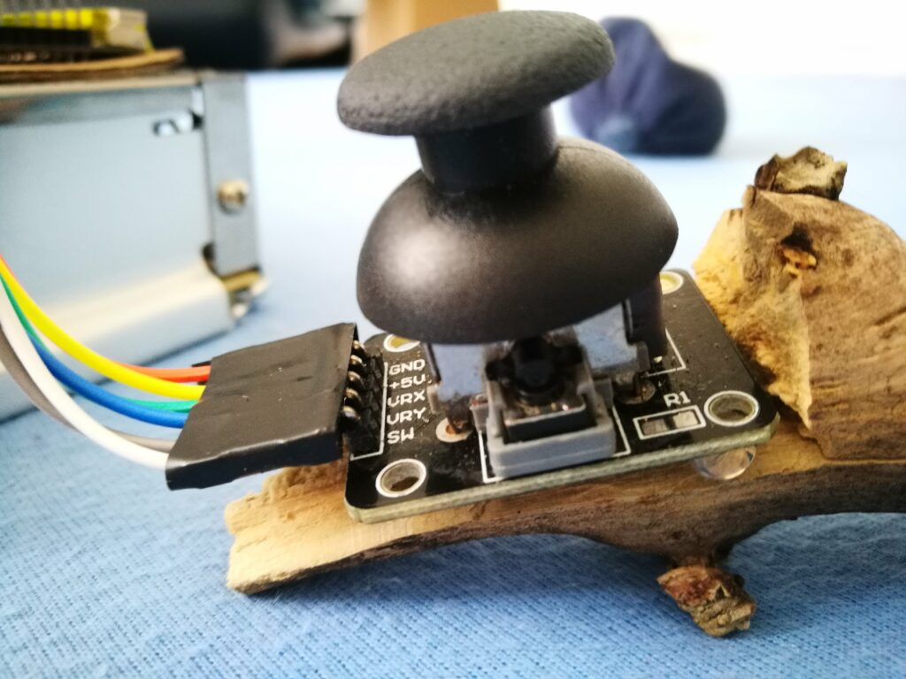

import Youtube from "@/components/Youtube";
import Gallery from "@/components/Gallery.astro";

Pewnego razu, na początku 2018 roku, zacząłem budować swoją własną matrycę LED. Plan był dość prosty. Wziąć taśmę LED z Chin, umieścić ją na tekturze i podłączyć do Arduino. Wiedziałem, że to możliwe, ponieważ widziałem wiele razy podobne projekty na YouTube.

## Pierwotny plan
Chciałem stworzyć macierz o wymiarach 10x30 pikseli. Mimo że nie byłaby ona wystarczająca do wyświetlania obrazów, to miałaby wystarczająco dużo pikseli, aby zagrać w proste gry takie jak Tetris czy Pong, a także wyświetlać animacje lub jednolite kolory. Macierz ta miałaby wymiary około 33x100 cm. Jednak, kiedy otrzymałem LED-y z Chin, okazało się, że nie mogę nimi sterować indywidualnie - każde trzy z nich były połączone szeregowo. To oznaczało, że zamiast 300 pikseli, miałbym tylko 100. Co więcej, każdy piksel miał średnicę 10x10 cm, co oznaczało, że macierz miałaby wymiary aż 1mx1m.

Te diody LED są naprawdę wysokiej jakości. Jednak nie mogłem się powstrzymać od śmiechu, kiedy zauważyłem napis na opakowaniu mówiący, że "nie potrafią sobie wyobrazić, jak piękne może być życie bez mnie". To trochę zabawne, ale jednocześnie ma w sobie nutkę mroku.

## Zabawa LEDami
Kiedy moje przesyłki w końcu dotarły z Chin, szybko podłączyłem je do Arduino i zacząłem się nimi bawić.

<Youtube videoId="2-hwGV2hLpU" />

Pierwsze użycie taśmy LED

## Budowa matrycy
Po zabawie z taśmami LED nadeszła pora na konstrukcję: skleiłem kawałki tektury, tworząc płytę o wymiarach 1x1m. Gdy wszystko zostało podłączone do zasilania i Arduino, muszę przyznać, że oprogramowanie do sterowania diodami LED zrobiło na mnie ogromne wrażenie.

<Youtube videoId="JDR4Wz0-VFU" />
Zabawa z matrycą LED

## Dalszy montaż
<Youtube videoId="I-fwW-TVWJo" />

Rozdzieliłem piksele za pomocą pasków tektury, które przymocowałem do tylnej płyty za pomocą kleju na gorąco. Następnie pokryłem to folią, aby rozproszyć światło i stworzyć wrażenie kwadratowych pikseli.

<Youtube videoId="MXAwmhOfveE" />
Porównanie tablicy z folią i bez

## Pisanie kodu
Kiedy sprzęt był już gotowy, uruchomiłem Arduino IDE i zaimplementowałem gry Snake oraz Tetris, uznając je za odpowiednie dla ekranu o rozdzielczości 10px na 10px. Kod źródłowy tych gier mam gdzieś na starej płycie, i gdy tylko go odnajdę, z przyjemnością się nim podzielę.
<Youtube videoId="MBs8jBqcsIw" />
Pisanie kodu Snake

## Testowanie
<Youtube videoId="lzloEHUfXow" />
Testowanie wyświetlania cyfr na matrycy LED

## Gry
<Youtube videoId="pGL7U9LC1UQ" />
Gra w Snake, zegar gry nie został jeszcze zaimplementowany.

<Youtube videoId="2nQtkvzXlh8" />
Gra w Tetrisa

## Kontroler
No cóż, kontroler gry powstał z kawałka drewnianego patyczka, który znalazłem na dworze... Zdjęcia mówią same za siebie.

<Gallery dir="led-matrix" names={["controller-wiring", "controller-wiring-with-laptop", "controller-in-all-its-glory"]} />

<Youtube videoId="BXvUJtiB-Cc" />

## Co dalej?
Chciałbym wykonać kolejną wersję z PVC i pleksi, aby uzyskać estetycznie lepsze wykończenie. Zamiast Arduino, chciałbym użyć Raspberry Pi oraz zastąpić drewniany patyczek klasycznymi kontrolerami retro.
<Gallery dir="led-matrix" names={["nes-controller", "nespi", "raspberry-pi"]} />

## Uznanie autorstwa
Trzy ostatnie zdjęcia nie należą do mnie, więc zostały użyte z podaniem źródła.

- Evan-Amos, Public domain, via Wikimedia Commons
- Gareth Halfacree from Bradford, UK, CC BY-SA 2.0 https://creativecommons.org/licenses/by-sa/2.0, via Wikimedia Commons
- Michael Henzler / Wikimedia Commons

Pozostałe zdjęcia i filmy są mojego autorstwa, a ja publikuję je jako utwory w domenie publicznej.