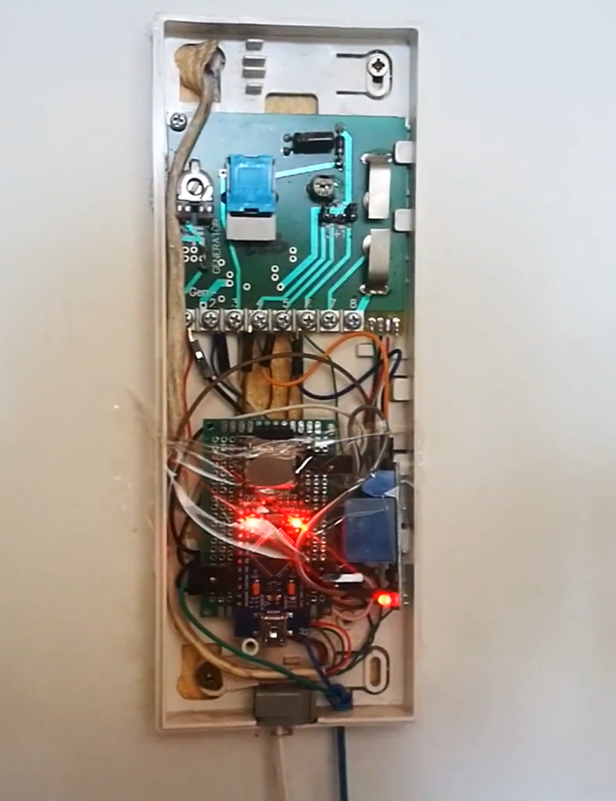
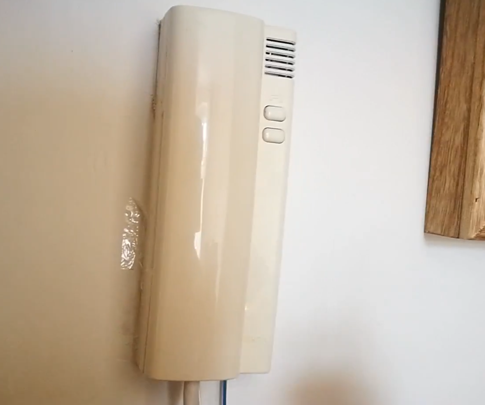
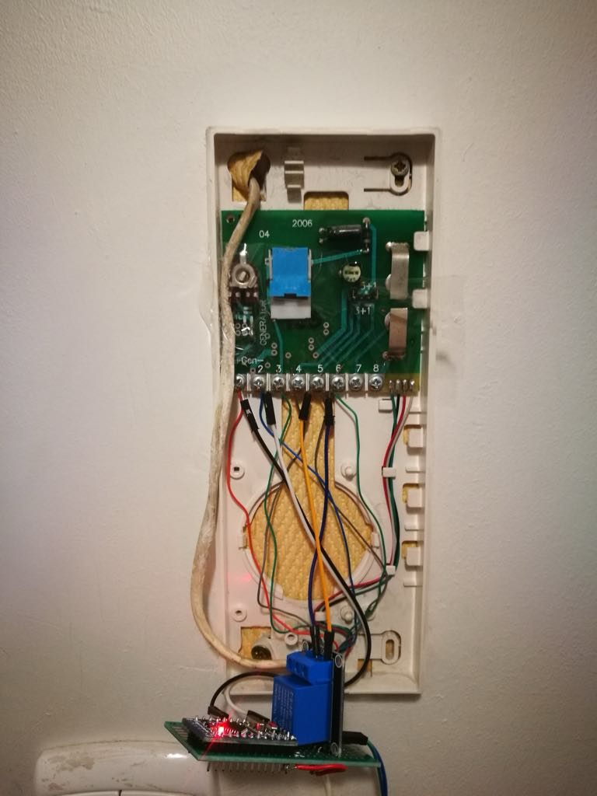

import Youtube from "../../../components/Youtube.astro"

In 2018, I was staying at a friend’s place. I made a copy of the apartment keys, but it was impossible to duplicate the front door key as the original was bent. The locksmith said such a key couldn’t be copied. The original key could open the front door as usual, but when I asked if it could be straightened, the locksmith explained that it would almost certainly break. I couldn’t really ask the landlord for an extra key because, well, they didn’t know I was living there.

## The Intercom Worked Well

The intercom was typical for an old building near the Olsztyn Old Town. Each apartment had its own button, with no codes or advanced features. Here’s how the intercom functioned:
1. Call a specific apartment.
2. Answer the call.
3. Talk.
4. Open the door.
My plan was to connect an Arduino to features 1 and 4. Later, I discovered it was quite amusing to tap into feature 3.

## Arduino

I bought a few Arduino boards from a Chinese seller for two dollars each. Using a multimeter and the intercom documentation I found online, I figured out which pins to connect to the Arduino's ADC. Implementing it was fairly straightforward. The only annoying part was uploading code to the Arduino—this is always a hassle with such projects unless you have exceptionally long cables or clever code-upload methods like WiFi. I didn’t have any of that.
<Youtube videoId="6tuDXU8ow9M" />

## Algorithm
To open the door, I needed to call my apartment four times at specific intervals. This would trigger a relay in the circuit where the door is usually opened. I had to set broad timing tolerances to make it usable and include a timeout for when the system would reset.
<Youtube videoId="KKOZTo64eQk" />

## Wifi
By 2018, everyone had a smartphone, so you might wonder why I didn’t just use that for remotely opening the door after connecting to the intercom line. Simply put, it was too unstable—I didn’t want to rely on it. Remember, this was my only way to access the building when my friend wasn’t home. There were a few times when I had it set up with WiFi using ESP32, and for some unknown reason, it froze and stopped working.

## Sounds
<Youtube videoId="lfNpqSJsEVw" />
Once I had the basic system working, I started thinking about enhancements. It turned out to be quite simple to tap into the line transmitting the intercom audio—an analog signal. I connected a tiny MP3 player board from a Chinese seller, about the size of a micro-SD card. I loaded it with funny sounds, which played whenever the correct "code" (four rings at even intervals) was entered. 