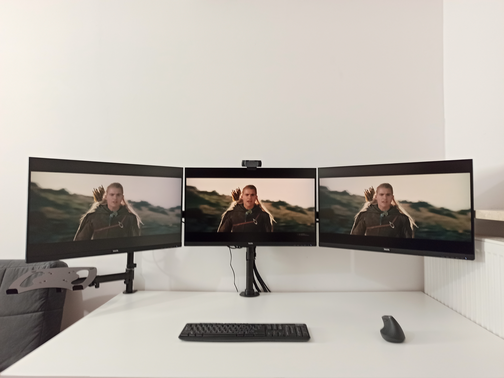
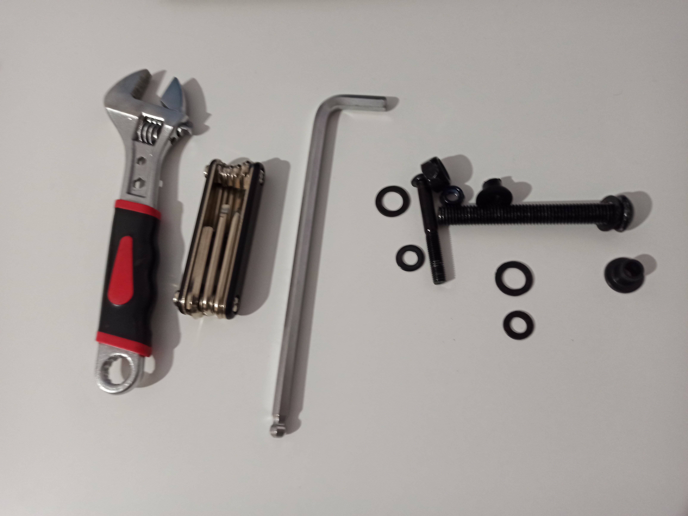
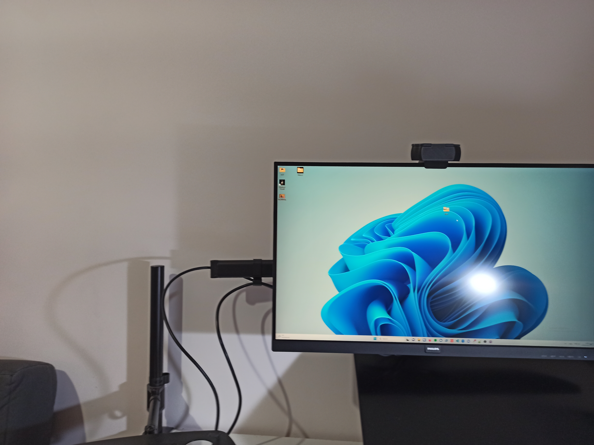
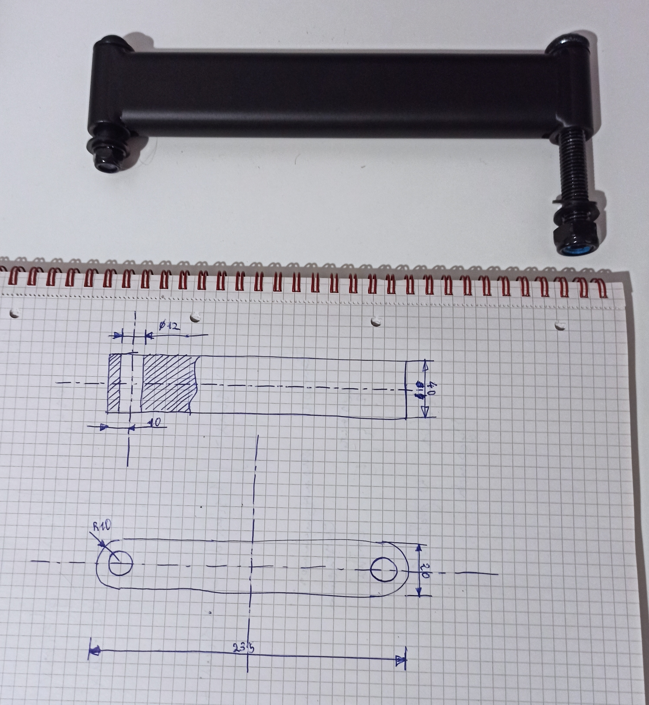
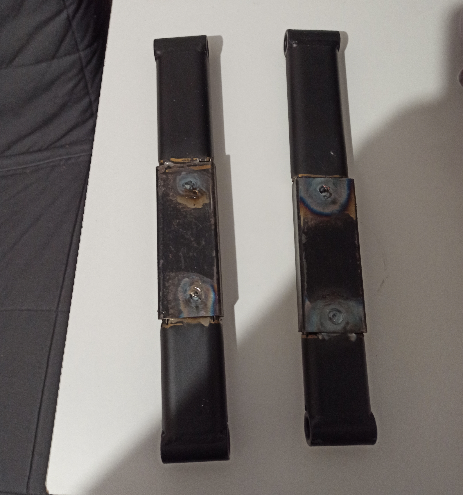

import Gallery from "./Gallery"

## Problem
The seller of the monitor stand I bought claimed it was suitable for monitors up to 27 inches in diagonal size. Technically, this was true, but only if the monitors were positioned in a single plane. However, I wanted my side monitors to be tilted inward, and the arms of the stand were too short, so I couldn't tighten the monitors to the angle I wanted.

## Concept
I had been thinking about how to solve this problem for some time. The obvious solution seemed to be to order a different stand that would fit properly. However, I dislike the hassle of returning products, particularly since it wasn't delivered via a parcel locker, so I would have to pay for the return. Plus, the stand worked well for me except for this one thing. And it was cheap.

## Hackerspace
I had been a member of a hackerspace before the pandemic, but I didn't really get into it, and it only lasted one month :p This time, I decided to join for a longer period. In the hackerspace, the best things were the people - they were open and helpful in realizing projects. The second-best thing was the heavy workshop, which had a welding machine :) I had taken a TIG welding course a few years ago, and since then I hadn't had the opportunity to weld anything. This project seemed like the perfect excuse to use the welding machine and to feel like I was doing something worthwhile!

## Project
Things picked up when a friend came over, and we spent the whole Saturday working on some code. He helped me disassemble the monitor stand and even drew a technical drawing :)

## Implementation
Once I had the disassembled stand and everything was measured, it was time to implement the project. First, I cut the part roughly in half using a band saw (thanks to the person from HS who showed me how to operate it). As you can see in the pictures, it didn't really come out half, but I followed the advice of another friend from HS who said that if I pulled out the ruler, we wouldn't get anywhere :p
After cutting the part in half, I looked through various steel profiles lying in HS and chose the one that seemed to be the most similar to the original. The problem was that the original profile had a rectangular cross-section with rounded shorter sides, while the profile I wanted to use for the extension had a rectangular cross-section. This is where the angle grinder and hammer came in handy :) In short, I cut into the ends of the original material to a depth of about 20 mm and profiled them with a hammer so that they would fit into the found shape. Then I drilled 8 mm diameter holes in the shape. These holes were later used to weld the original part and the extension together.

## Welding
As it turned out, the time that had passed since the welding course had left its mark on my skills. The first success was managing to start the welding machine, unscrew the argon cylinder, and sharpen the tungsten electrode. The first attempt to weld at 120 amperes resulted in melting a hole in the material. So, I reduced the current to 60 A, and it went much better from then on. I only had to make 8 welds. Initially, I didn't appreciate the difficulty of welding in a hole. I tried to do it without adding filler material, but my hand forgot how to weld, and I kept touching the material with the electrode.

After each such touch, I had to remove the welding mask, take off the welding gloves, remove the electrode, stand up, go to the table grinder wearing protective glasses, start the grinder, sharpen the electrode, turn off the grinder, go back to the welding station, place the electrode in the welding holder, put on the mask and gloves again. Unfortunately, I had to repeat these steps several times until my hand remembered how to hold the welding grip to avoid dirtying the electrode.

<Gallery names={["mounted-close", "mounted-far", "mounted-view-from-behind"]} />

I was in a hurry because the project had already taken about 3 hours, and I wanted to finish it. Therefore, the quality of the welds wasn't amazing, but in the end, everything worked as it should!