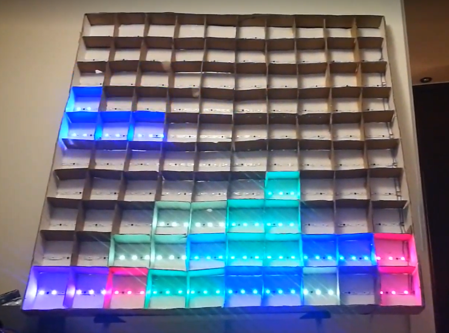
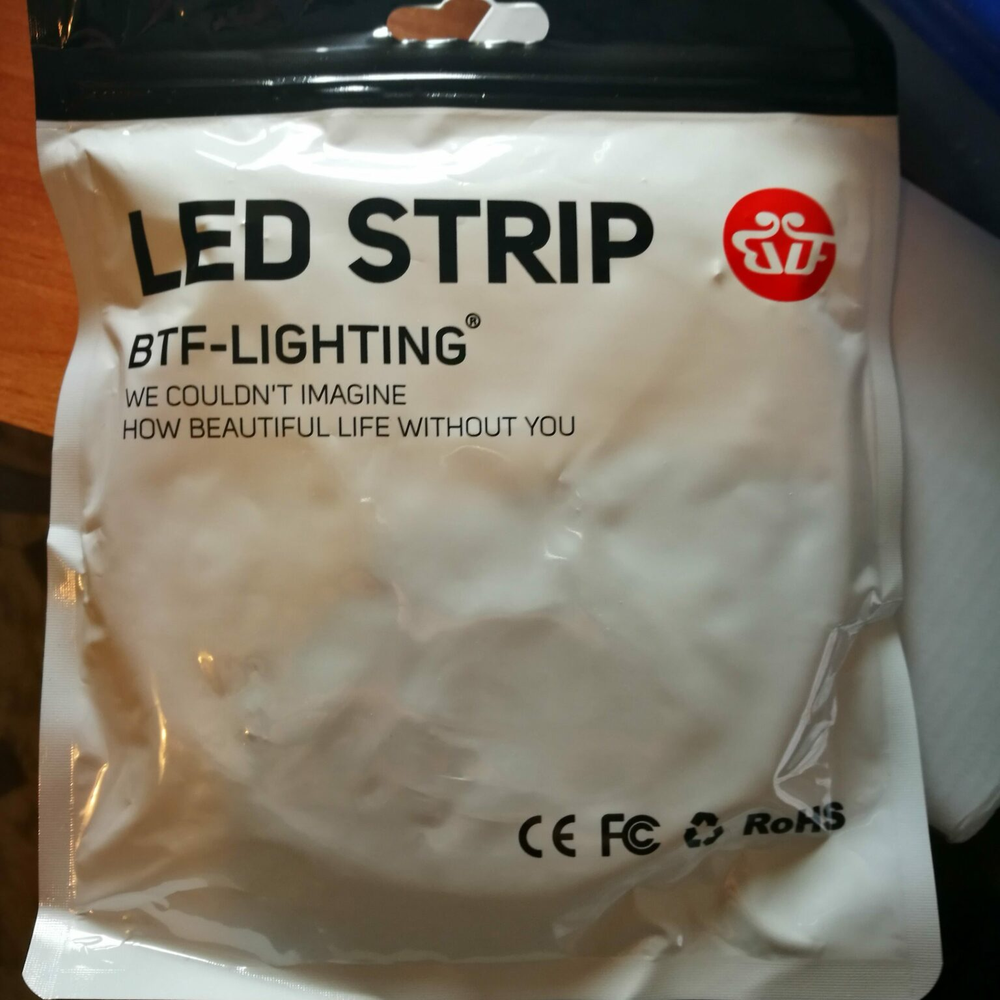
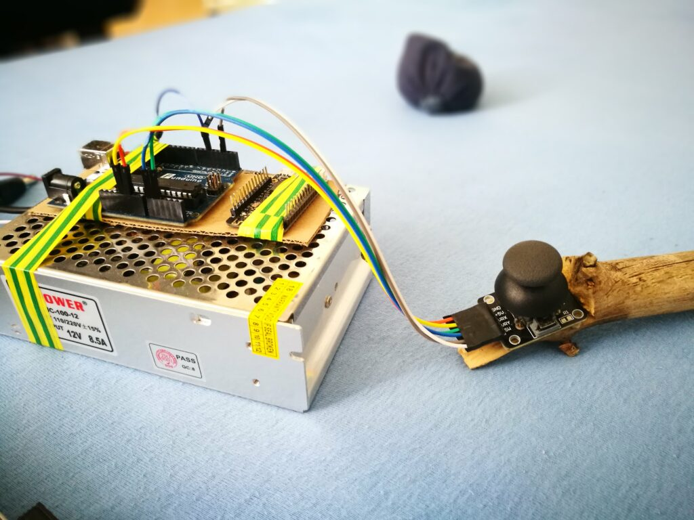
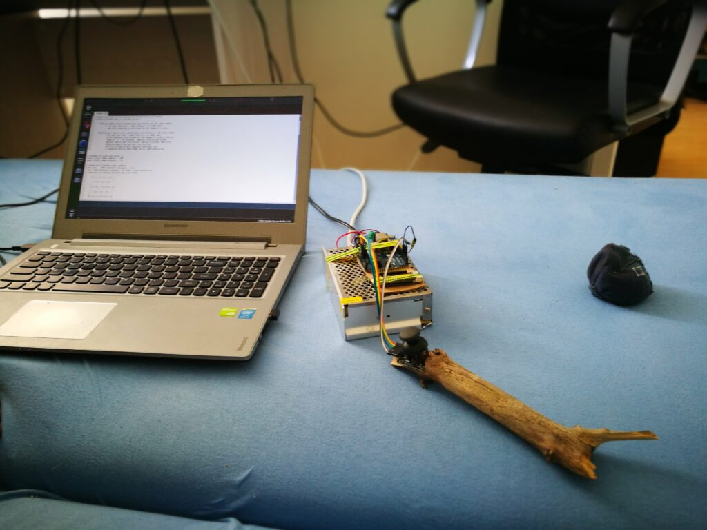
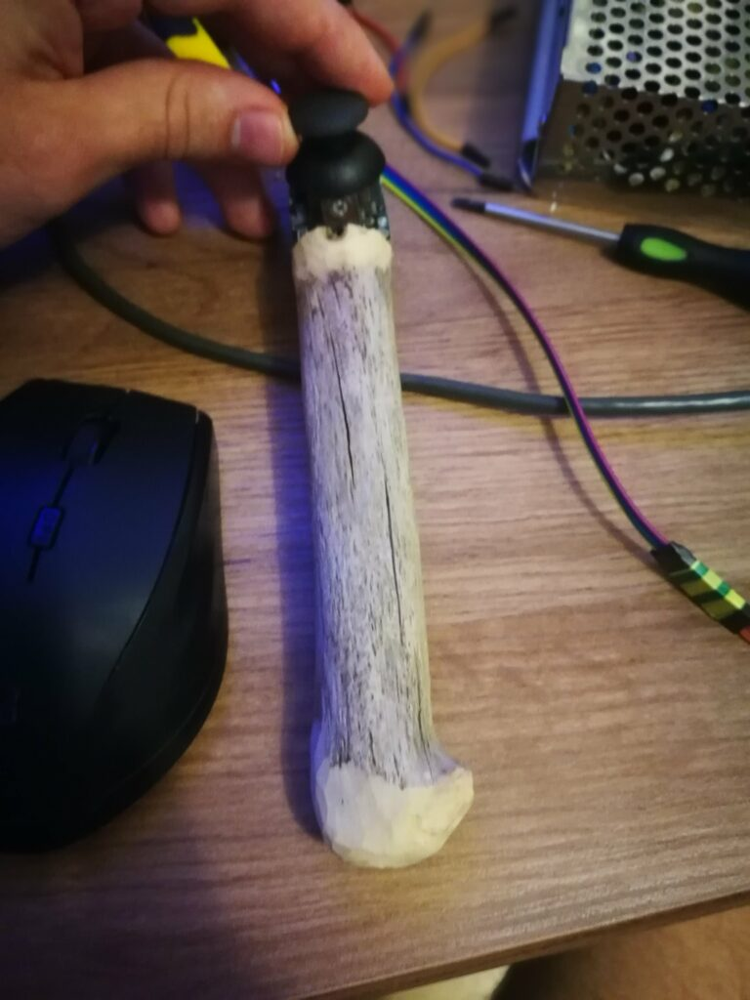
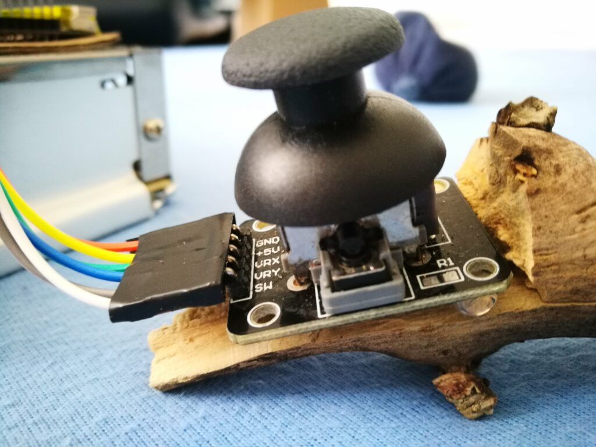

import GalleryWhatsNext from "./Gallery/GalleryWhatsNext"

Tetris played on my DIY LED matrix

Sometime in early 2018 I started building my DIY LED matrix. Plan was quite simple. Take led strip from China, put it on cardboard, and connect it into arduino. I knew it was possible, because i saw projects like that many times on YouTube.
## Original plan  

I wanted to have 10×30 pixels on my matrix, maybe not enough to display images, but sufficient to play some simple games, like tetris or pong, maybe display some animations, or just plain colors. It would have dimensions like 33 x 100 cm. When LEDs from China arrived, I was surprised to notice, that I cant control them individually, but every 3 of them are connected in series. It meant that instead of 300 pixels, I would only have 100. Also every pixel would have 10×10 cm diameters, giving me matrix with size of 1mx1m.

These are very good LEDs. However I laughed for a while when i noticed that “they couldn’t imagine how beautiful life without me”. A little dark.
## Playing with LEDs
When my packages finally arrived from China, I quickly connected them to arduino and started playing with them.
`youtube: 2-hwGV2hLpU`
First usage of LED strip
## Building matrix

Well, after having some fun with LED strips it was time to glue together some cardboard, and make backplate with size 1x1m, Than I plugged everything to power supply and arduino, and was truly amazed with LED control software
`youtube: JDR4Wz0-VFU`
Playing around with LED matrix

## Further assembly

`youtube: I-fwW-TVWJo`
I separated pixels with stripes of cardboard secured to the backplate with hot glue. After that I covered it with foil, to disperse light, and create sensation of square pixels.

`youtube: MXAwmhOfveE`
Comparison of matrix with and without foil

## Writing code

When hardware was ready i opened Arduino IDE and implemented Snake and Tetris, because i thought those are appropriate games for screen with resolution of 10px x 10px. I have source code for that somewhere on old hard drive, and I will share it, when I will find it.
`youtube: MBs8jBqcsIw`
Writing code for snake

## Testing

`youtube: lzloEHUfXow`
Testing display of numbers on LED matrix

## Games
`youtube: pGL7U9LC1UQ`
Snake gameplay without game clock implemented yet

`youtube: 2nQtkvzXlh8`
Tetris gameplay

## Game controller

Well, game controller was made from piece of wooden stick that i found outside… let pictures speak for themselves

controller wiring

controller wiring

controller in all its glory

close-up on joystick
`youtube: BXvUJtiB-Cc`

## Whats next?

I would like to make another one with PVC and plexiglass to have nicer finish. I would like to use Raspberry Pi instead of Arduino and retro controllers instead of wooden stick
<GalleryWhatsNext />
## Images attribution

Last three images are not mine, so are reused with attribution

    Evan-Amos, Public domain, via Wikimedia Commons
    Gareth Halfacree from Bradford, UK, CC BY-SA 2.0 https://creativecommons.org/licenses/by-sa/2.0, via Wikimedia Commons
    Michael Henzler / Wikimedia Commons

All other images and videos were created by me, and I publish them as Pubic Domain
