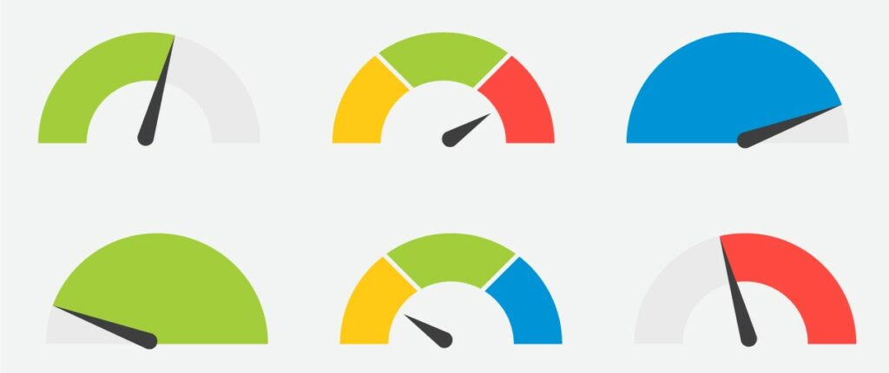

Aplikacje stworzone z myślą o obsłudze dużej ilości użytkowników potrafią wygenerować duże rachunki za zużycie serwerów. Czasami chcemy wprowadzić optymalizację która ma poprawić wydajność, ale jak sprawdzić czy faktycznie tak jest?

## Korzyści testów wydajnościowych

Z tematem load-testingu spotkałem się już w pracy. Generalnie najprostszy wariant to przytrzymać F5 na otwartej stronie którą chcemy przetestować i jak serwer wytrzyma – dobra nasza :p. Czasami jednak przydatne jest ilościowe podejście do sprawy. Dobrze żeby narzędzie do testów wydajnościowych pokazało jakiś raport w którym zawarte będą konkretne informacje – ile czasu średnio potrzebował request na dany endpoint, jaką mieliśmy wariancję, określone percentyle (np 50, 75, 90, 99), czy wszelkie inne dobra dostarczane przez statystykę matematyczną.

## Jak zamierzam przedstawić temat?

W celu przybliżenia tego tematu, postaram się omówić jego istotne elementy, a także zaprezentować w jaki sposób można zaimplementować takie testy wydajnościowe na przykładzie Python i Azure. Jednocześnie postaram się żeby ten przykład był na tyle uniwersalny żeby można go było potraktować jako rusztowanie do rzeczywistych zastosowań. W tym celu zostanie stworzone repo na github z całym potrzebnym kodem oraz seria streamów na Youtube gdzie będę po kolei przechodził przez cały proces. Linki do YT oraz GH znajdują się na stronie głównej

## Inspiracje

[Python script useful for stress testing systems](https://gist.github.com/mda590/7a9a6b21b74ae10aa350b1703e2724a0)

[Performing load tests with Python + Locust.io | by Thiago Ferreira | Medium](https://medium.com/@tferreiraw/performing-load-tests-with-python-locust-io-62de7d91eebd)

[Performance Testing vs. Load Testing vs. Stress Testing | Blazemeter by Perforce](https://www.blazemeter.com/blog/performance-testing-vs-load-testing-vs-stress-testing)