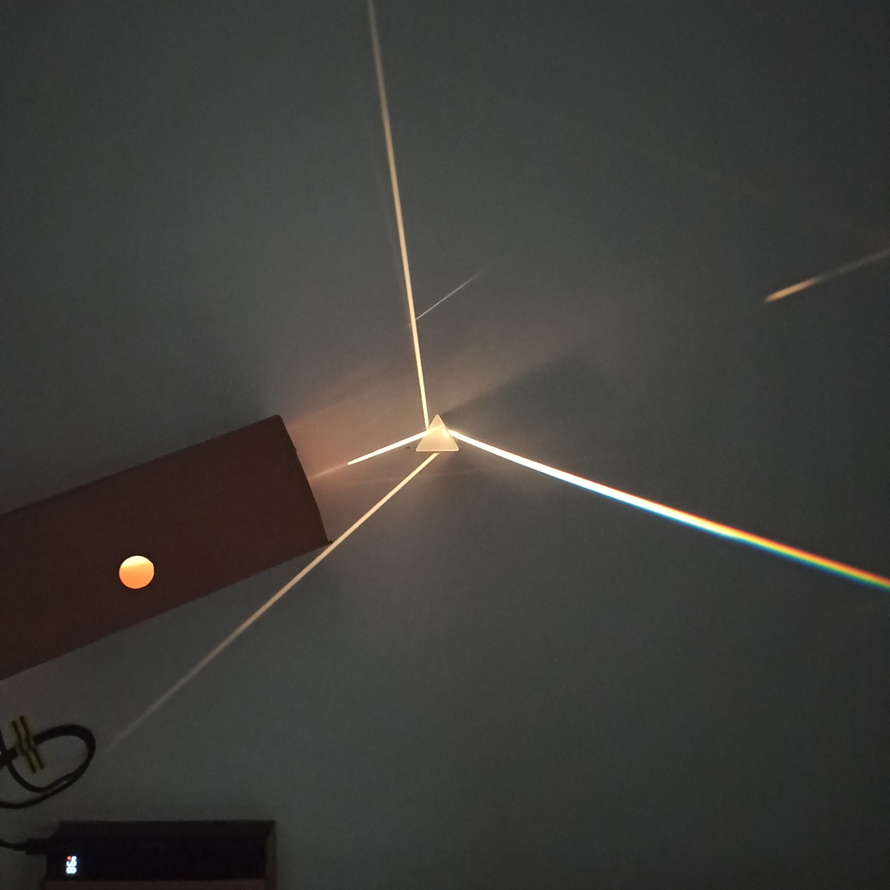

import Gallery from './Gallery'

## Cel
Każdy fan Pink Floyd zna płytę Dark Side Of The Moon. Wiele osób nawet nie znających tej płyty kojarzy jej ikoniczą okładkę. Jest ona bardzo prosta - zawiera schemat rozszeczepienia światła białego na pryzmacie. Jest to ciekawe zjawisko. Nie znający go mogą się zastanawiać jak to możliwe - ze światłem białym nie kojarzy się żadna barwa - jest ono neutralne - może być co najwyżej jaśniejsze lub ciemniejsze. Jak się jednak okazuje są w nim ukryte wszystkie barwy tęczy

## Pryzmat
Od dziecka chciałem wykonać to doświadczenie, jednak z wiekiem zapomina się o dziecięcych marzeniach i jak wiele innych zaleglo ono na zakurzonym regale przeszłości.

## Muzyka
Mówi się że muzyka łagodzi obyczaje, jednak gdy puszczałem przy mojej dziewczynie muzykę którą lubię, szybko przeszliśmy do rozmowy o guście muzycznym. Dokładniej przedmiotem rozmowy były utwory które oboje lubimy i możemy słuchać ich wspólnie. Dość powiedzieć że początkowo była to krótka lista i obejmowała właśnie DSOTM i nic ponadto. Jak się okazało zacząłem wiele razy dziennie odtwarzać sobie nagrania Pink Floyd z tego albumu. Za każdym razem była to ciekawa wędrówka, szczególnie gdy odbywało się ją od początku do końca.

## Okładka
Aby dopełnić doświadczenia w pewnym momencie tchnęło mnie że być może rysunek rozszczepienia światła nie oddaje tego samego co faktyczne barwy składowe światła białego. Okładkę oglądałem tylko na ekranie smartfona lub komputera. Jak wiemy barwy na takich ekranach powstają z trzech barw - czerwonej, zielonej i niebieskiej. Ludzkie oko jest wrażliwe tylko na te barwy więc tak się składa że w ten sposób można "oszukać" narząd wzroku żeby widział np kolor żółty, podczas gdy w świetle emitowanym przez ekran nie ma fali o dłgości odpowiadającej barwie żółtej. Więc można powiedzieć że widzimy ten kolor, ale go tam nie ma.

## Fiolet
W zasadzie nie stanowi to większego problemu. Z doświadczenia wiemy że "oszukiwanie" oka żeby za pomocą modyfikacji natężenia trzech kolorów móc zobaczyć ich miliony, sprawdza się bardzo dobrze. Przeglądając internet czy robiąc cokolwiek innego na ekranie trudno powiedzieć że jest zbyt mało "kolorowo". A jednak chciałem wykonać ten eksperyment, doświadzyć własnej małej tęczy i stwierdzić samodzielnie czy coś mi nie umyka. Najciekawszy z tego wszystkiego okazał się fiolet. Kolor na samym krańcu spektrum. Nie da się go doświadczyć na ekranie elektronicznym. Z takich lub innych powodów źródło światła niebieskiego ma większą długość fali - jest bardziej niebieskie. W warunkach naturalnych oczywiście ten kolor istnieje - jest to coś w rodzaju koloru atramentowego.

## Układ
Żeby móc wykonać doświadczenie, zamówiłem potrzebne komponenty
- Pryzmat
- Żarówka halogenowa 10W 12V
- Power bank
- Terminal 12V do USB-C Power Delivery

Aby móc zaobserwować rozszczepienie światła dość istotne jest aby wiązka światła padająca na pryzmat była nie zbyt duża (przekrój poprzeczny) oraz aby promienie tej wiązki były równoległe (w miarę możlwiości). W pierwszej iteracji prototypu w celu uzyskania równoległej wiązki światła zamknąłem żarówkę w pudełku. Zrobiłem w nim otwór o średnikcy kilku milimetrów. Żarówka znajdowała się kilkanaście centymetrów od otworu, tak aby wychodzące przez niego promienie były +/- równoległe.

## Ustawienie pryzmatu
Jak się okazało było to niebanalne zadanie. W takich improwizowanych warunkach, z początkowo małą jasnością wiązki, uzyskanie rozszczepienia światła było dość trudne. Trzeba było trochę pokręcić pryzmatem aby kąt i miejsce padania światła na pryzmat było odpowiednie.

## Obserwacje
Początkowo obserwowałem rozszczepione światło na kartce papieru. Było to satysfakcjonujące na początku, jednak chciałem zobaczyć więcej. Postanowiłem że spojrzę bezpośrednio w pryzmat. Szybko oszacowałem w głowie że żarówka ma 10W i nie ślepnę patrząc na nią bezpośrednio, a światło rozszczepione to ułamek tego co przedostaje się przez otwór w pudełku, który z kolei przepuszcza ułamek całego światła generowanego przez żarówkę. Podsumowując uznałem że będzie to bezpieczne dla moich oczu.

## Patrząc w spektrum
Bezpośrednie doświadczenie spoglądania w spektrum to coś co polecam każdemu. Całe spektrum miało kilka centymetrów długości. Przesuwałem głowę z prawa do lewa i barwy zmieniały się. Niby nic wielkiego. Ale barwy były czyste, osobne a jednocześnie połączone. Trudno powiedzieć czy z fizjologicznego punktu widzenia czym innym jest patrzenie na kolor żółty wygenerowany przez ekran smartfona niż patrzenie na kolor żółty wchodzący w skład spektrum. Przypuszczam że nie. Ale moje wrażenie i doświadczenie spektrum jako czegoś rzeczywistego i istniejącego było ważnym dopełnieniem DSOTM. Tam dostrzegłem również fiolet o którym już wspomniałem, a który tak trudno zobaczyć w innych warunkach. Szczególnie w takiej czystości.

## Mankamenty układu
Po pierwsze - mało było tej tęczy. Można było ją tylko zobaczyć w ciemnym pomieszczeniu. Docelowo chciałem mieć interaktywną dekorację którą można podziwiać nie tylko w ciemni. Po drugie miałem źródło światła punktowe - cieżko było by je zwizualizować na ekranie w podobny sposób jak na okładce DSOTM. Po trzecie - układ był dość duży i mało kompaktowy, raczej niepraktyczny do zastosowania jako dekoracja.

## Ulepszenia
Dość ważną cechą układu było dla mnie zasilanie bateryjne - aby nie było konieczne podłączenie do sieci w trakcie korzystania. Stąd też napięcie wybranej żarówki 12V. 

### Żarówka
<Gallery names={["bulbs"]}/>
Próbowałem z mocniejszą żarówką - 20W, jednak tutaj z niewiadomych mi powodów powerbank się wyłączał - mimo że teoretycznie może podawać moc do 30W (w tym ok 2A przy 12V) więc powinno to działać. Być może jest to związane z tym że żarówka podczas włączania (rozgrzewania) ma mniejszy opór niż podczas świecenia, a zatem również większą moc i potrzebny amperaż. Być może jest to zupełnie inny problem związany z komunikacją mięszy terminalem power-delivery a power bankiem. Tak czy inaczej, zostałem przy żarówce halogenowej 10W 12V o złączu G4.

### Zwierciadło
Aby zwiększyć intensywność wiązki światła bez zwiększania mocy żarówki, postanowiłem zastosować reflektor. W tym celu kupiłem dwie latarki i zwierciadło paraboliczne. Z praktycznego punktu widzenia najbardziej sensowne było zastosowanie reflektora ze starej latarki sygnałowej. Był to po prostu kawałek wytłoczonego metalu w środku którego znajdował się otwór na żarówkę. Zwierciadło z drugiej latarki było plastikowe i stopiło się z bliskości gorącej żarówki. Zwierciadło paraboliczne początkowo wydawało się najbardziej obiecujące. Miało bardzo gładką powierzchnię i zdaje się że miało również szklaną powłokę, jednak brak otworu w środku sprawił że użycie go w układzie byłoby bardziej kłopotliwe.
<Gallery names={["good-mirror-back", "good-mirror-front", "good-mirror-side"]}/>
<Gallery names={["parabolic-mirror-with-bulb", "parabolic-mirror-with-bulb-front"]}/>
<Gallery names={["signaling-flashlight", "bad-flashlight"]}/>

### Soczewka
Spytałem również w hackerspace czy ktoś ma pomysł na ulepszenie układu i jeden z kolegów zasugerował żeby użyć soczewki. Wydaje się to całkiem sensowne. Ale nie mam soczewki i uznałem że narazie nie będę szedł tą drogą.

### Sczelina
<Gallery names={["small-rainbow", "big-rainbow"]}/>
Tutaj zainspirowałem się układami optycznymi do doświadczeń szkolnych. Zauważyłem w ofertach, że pryzmat ma na jedej ściance osłonę z podłużną szczeliną. Stosując szczelinę zamiast okrągłego otworu, dostaję więcej tęczy :)

## Iteracja 2
<Gallery names={["iteration-2-demo"]}/>
Stosując ulepszenia o których wyżej wspomniałem zbudowałem kolejny układ z kartonu z użyciem kleju na gorąco. Działało to zaskakująco dobrze. Pozostały jedynie dwa maknamenty - brak możliwości regulacji położenia reflektora względem żarówki, oraz mała precyzja wymiarów szczeliny (wycięta nożem do tapet w kartonie). Postanowiłem że w takim razie czas na kolejny prototyp.

## Iteracja 3
Wybrałem się do hackerspace. Tutaj należy wspomnieć o bardzo pomocnych członkach tej społeczności. Chciałem wyciąć coś laserem w płycie HDF 2mm - pyk jest kolega któy pokazał mi wszystko co i jak i już umiem obsługiwać tą maszynę. Projekty były dość proste i znajdują się w publicznym repozytorium na GitHub. Całość to pięć kwadratów 9x9cm wyciętych laserowo w płycie HDF z odpowiednimi ficzerami. Dwa kwadraty odpowiadają za formację wiązki - oba zawierają szczelinę o szerokości 1mm. Kolejne dwa kwadraty są uchwytem do zwierciadła. Ostatni kwadrat to uchwyt dla gniazda G4 w którym znajduje się żarówka. Całość jest skręcona na prętach gwintowanych M5. Wyszło to zaskakująco dobrze - udało się rozwiązać nawiększe problemy z iteracji 2 - czyli szczelina była precyzyjna i miałem możliwość dostosowania położenia zwierciadła względem żarówki w taki sposób aby znajdowała się mniejw więcej w jego ognisku.
<Gallery names={["iteration-3-assembled-top", "iteration-3-assembled-top-front", "iteration-3-assembled-top-back"]}/>
<Gallery names={["iteration-3-early-test", "iteration-3-screen"]}/>

## Finalizacja
Myślałem że może by coś jeszcze lepiej - ale głos że jest wystarczająco dobrze zwyciężył i zdecydowałem się przejść do końcowej fazy projektu. W tym celu kupiłem białą płytę meblową o rozmiarach 70 x 70 cm. Używając termo gluta zamontowałem pryzmat, źródło światła i powerbank na płycie. Podłączyłem kabelki i pyk - wszysko działało mniej więcej tak jak sobie to wyobrażałem. Problematyczne okazało się gdzie umieścić tą dekorację. Moje mieszkanie nie należy do największych i o wiercenie dziur w ścianach trzeb pytać landlorda. W związku z tym roboczo umieściłem dekorację nad toaletą i w ten sposób uzyskała nową nazwę - Dark Side Of The Piss
<Gallery names={["prism-on-the-board", "final-assembly-top", "final-assembly-bottom"]}/>

## Co dalej?
Może kiedyś to ulepszę, ale póki co temat uważam za zamknięty. Jeden z moich kolegów zajmujący się muzyką, zainspirował się moim projektem. Nagrał intro podobne rytmicznie do wstępu do Money z DSOTM. Zamiast dźwięków kojarzących się z pieniędzmi użył dźwięków kojarzących się z umiejscowieniem dekoracji.
<Gallery names={["dark-side-of-the-piss"]}/>